  
  

---

## About Me

* 🎓 B.S. in Computer Science, Honors Scholars Program — University of Colorado Denver
* 🤖 AI Fellow at **Colorado Thrives**, building agentic AI pipelines for a workforce network serving more than 120,000 stakeholders
* 🧠 Former Machine Learning Research Intern at **CU Anschutz Medical Campus**, where I developed high-throughput pipelines for spatial transcriptomics research
* 🛠️ Interested in distributed systems, backend infrastructure, data engineering, and AI agent architectures
* 📫 Reach me through [email](mailto:yaseersabir005@gmail.com) or [LinkedIn](https://www.linkedin.com/in/yaseer-sabir-0a24b4200/)

---

## Tech Stack

### Languages

  
  
  
  
  
  

### Backend, Web, and Machine Learning

  
  
  
  

### Cloud, Infrastructure, and Distributed Systems

  
  
  
  
  
  

### Data Engineering and Observability

  
  
  
  
  
  

---

## Featured Projects

### SpatiaScale — Cloud-Native Distributed Query Engine

`AWS EKS` · `Amazon S3` · `ElastiCache` · `gRPC` · `Apache Arrow`

* Built a fault-tolerant spatial query engine on AWS EKS for indexing more than **148 million multidimensional points** derived from over **500 million raw rows** in Amazon S3.
* Achieved **7.77 ms p99 query latency** during testing on live EKS traffic.
* Reduced memory usage by **76%** through quadtree-based spatial partitioning and ElastiCache-backed caching.
* Improved deserialization performance by **11.3×** using a gRPC and Apache Arrow data-transfer layer.

### AI Drug Discovery Swarm

`Ray` · `Redis Streams` · `RDKit` · `AutoDock Vina` · `FHIR R4`

* Built a distributed multi-agent system that generates and ranks candidate molecular structures through evolutionary search and computational scoring.
* Designed explorer, chemist, property-screening, and selector agents that coordinate through Redis Streams.
* Evaluated candidates using predicted binding affinity, molecular properties, and synthetic accessibility metrics.
* Developed a FHIR R4-compatible Agent-to-Agent endpoint that maps gene variants to potential drug targets and returns ranked candidates in a structured FHIR bundle.
* Validated the system with **92 integration tests**.
* Placed **3rd out of 39 teams** at Lynx Hack 2026.

### Distributed Machine Learning Inference Pipeline

`FastAPI` · `Apache Kafka` · `Redis` · `Docker` · `PyTorch`

* Built a fault-tolerant distributed inference system using PyTorch ResNet-50.
* Load-tested the system at more than **10,000 simulated requests per second** across concurrent clients.
* Used Kafka-partitioned work queues to distribute inference workloads across workers.
* Reduced response latency by **85%** compared with the initial pipeline design.
* Added Redis-backed result caching and Docker-based service isolation.

### Trivia Wizards — Real-Time Multi-Interface Trivia Platform

`Next.js` · `Prisma` · `Supabase` · `PostgreSQL` · `Socket.IO`

* Built a full-stack trivia platform with three synchronized interfaces: host controls, player kiosks, and a shared display.
* Implemented real-time game-state synchronization using Socket.IO with WebSocket-only transport.
* Eliminated polling overhead to provide low-latency updates across every connected interface.
* Used Prisma and Supabase PostgreSQL for persistent game, question, and session data.

### ETL Pipeline — dbt, Snowflake, and Airflow

`dbt` · `Snowflake` · `Apache Airflow` · `Astronomer Cosmos`

* Built an end-to-end ELT pipeline for transforming raw TPC-H data in Snowflake.
* Organized transformations using a layered **staging → intermediate → mart** architecture in dbt.
* Orchestrated dbt models as native Airflow tasks through Astronomer Cosmos.
* Scheduled daily pipeline runs with dependency-aware task execution.
* Added source-level and mart-level data quality tests throughout the transformation workflow.

### LEGv8 Pipelined CPU Simulator

`Python` · `Computer Architecture` · `Pipeline Simulation`

* Built a cycle-accurate simulator for a five-stage pipelined LEGv8 processor.
* Implemented data forwarding, load-use stalls, control-hazard detection, and branch flushing.
* Added a toggleable forwarding unit for direct performance comparisons across hazard scenarios.
* Measured pipeline speedups of up to approximately **2.09×**, depending on instruction dependencies and hazard frequency.

---
